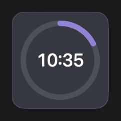
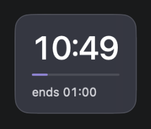

<div align="center">
  <p><a href="README.zh-TW.md">繁體中文版</a></p>
  <h1>Countdown Float</h1>
  <p>Keep your countdown visible on your desktop so you can stay focused without switching windows.</p>
  <p>
    <a href="https://github.com/koru1130/FloatingCountdown">
      
    </a>
    <a href="https://www.swift.org/">
      
    </a>
    <a href="https://developer.apple.com/xcode/">
      
    </a>
  </p>
</div>

<p align="center">
  
  
</p>

<p align="center">
  <sub>Current float screenshots: Ring mode and Bar mode.</sub>
</p>

## Product overview

Countdown Float is a native macOS menu-bar countdown utility. It puts a lightweight, draggable, always-on-top countdown float on your desktop, so you can keep an eye on your progress while coding, reading, attending a meeting, running a Pomodoro session, or waiting for a specific time.

The float, menu-bar item, setup panel, and completion notification all use one shared countdown state. Hiding the float only hides the window—the countdown continues to run in the background.

> This project is currently provided as an Xcode-buildable MVP source project. A signed `.app`, DMG, and other release binaries are not included yet.

## Features

- **Desktop countdown float**: Borderless, translucent, always-on-top, draggable, and available across Spaces.
- **Two display modes**: Choose between a Bar progress indicator and a Ring progress indicator.
- **Two input modes**: Start a countdown from a duration or set an absolute target time.
- **Flexible progress span**: Configure a Full span or Start time so the progress bar or ring can represent a larger work session.
- **Labels**: Give a countdown a task name, meeting name, or any other custom label.
- **Full lifecycle controls**: Start, Pause, Resume, Add 5 min, Stop, and End after completion.
- **Urgent state**: The final five minutes use a highlighted border, glow, and scale treatment.
- **Count-up after completion**: Once the countdown reaches zero, it displays `+mm:ss` so you can see how long it has been over time.
- **Menu-bar controls**: View the remaining time, show or hide the float, edit the countdown, and adjust its size from the menu bar.
- **System notifications**: Receive a macOS notification when the countdown completes, with direct `Add 5 min` and `End` actions.
- **No third-party dependencies**: Built with SwiftUI, AppKit, Combine, and UserNotifications.

## Screenshots and UI overview

| Surface | Description |
| --- | --- |
| **Float — Bar** | Shows the time, a horizontal progress bar, and an end time or label. |
| **Float — Ring** | Shows remaining progress as a circular ring in a compact layout. |
| **Setup panel** | Configure Duration or At a time, Full span, Start time, a label, and the float style. |
| **Menu-bar extra** | Shows the current remaining time, or `Set` when no countdown is active. |
| **Countdown menu** | Control float visibility, edit the countdown, pause, extend, stop, or quit. |
| **Completion toast / notification** | Shows the over-time state and provides extend or end actions. |

The two cropped screenshots above show the current Ring and Bar float surfaces. The complete UI states reference is available at [`DesignFromClaude/handoff/ui-states.png`](DesignFromClaude/handoff/ui-states.png); it is a design reference rather than a simulated desktop screenshot.

## Requirements

- macOS 13.0 or later
- Xcode 16 or later
- Swift 5 language mode
- No additional packages or third-party dependencies

## Installation and running

### Using Xcode

```sh
git clone https://github.com/koru1130/FloatingCountdown.git
cd FloatingCountdown
open CountdownFloat.xcodeproj
```

In Xcode, select the `CountdownFloat` scheme and press Run. The app is a menu-bar app, so it does not show a regular application icon in the Dock. On first launch, the setup panel opens next to the menu-bar item.

### Building from the command line

```sh
xcodebuild \
  -project CountdownFloat.xcodeproj \
  -scheme CountdownFloat \
  -configuration Debug \
  -destination 'platform=macOS' \
  -derivedDataPath .build/DerivedData \
  build \
  CODE_SIGNING_ALLOWED=NO
```

You can also use the project-local script to build and launch the app:

```sh
./script/build_and_run.sh
```

`script/build_and_run.sh` builds the Debug app and opens it by default. It first terminates any running process with the same name. Use `--verify` to check that the app launches successfully, or `--telemetry` to stream the app's runtime log.

## How to use

1. Click the Countdown Float item in the menu bar to open the `Set countdown` panel.
2. Choose an input mode:
   - **Duration**: Enter 1–600 minutes, or choose the 5, 15, 25, or 60-minute preset.
   - **At a time**: Enter a target time in `HH:mm`; a time that has already passed is treated as tomorrow.
3. Optionally enter a Full span, Start time, and Label.
4. Choose `Bar` or `Ring`, then press `Start`.
5. Drag the float to the position you want. Hover over it to reveal the reconfigure and hide controls.
6. Click the menu-bar item to open the control menu, including Pause／Resume, Add 5 min, Float size, and Stop.
7. When the countdown completes, the float switches to counting-up mode and a completion notification appears. If macOS asks for notification permission, allow it to receive system notifications and their quick actions.

### Time and progress rules

- Normal time uses `mm:ss`; durations longer than one hour use `h:mm:ss`.
- After completion, the display uses `+mm:ss` or `+h:mm:ss` to show elapsed overtime.
- The default Urgent threshold is five minutes remaining.
- `Add 5 min` adds 300 seconds and extends the total progress span.
- Hiding the float does not pause the countdown; the menu-bar item and notifications continue to update.
- Bar mode drains to zero at completion; Ring mode closes into a full circle.

## Interaction states

```text
Idle ── Start ──▶ Running ── Pause ──▶ Paused
  ▲                 │  ▲                │
  │                 │  └── Resume ──────┘
  │                 │
  │                 ├── Add 5 min ──▶ Running
  │                 │
  │                 └── Reach zero ──▶ Done / counting up
  │                                      │
  └──────────── Stop / End / Reset ◀────┘
```

## Project structure

```text
FloatingCountdown/
├── README.md
├── README.zh-TW.md
├── CountdownFloat.xcodeproj/
├── CountdownFloat/
│   ├── App/              # SwiftUI App and AppKit coordinator
│   ├── Model/            # Countdown state, time calculations, geometry, and scale settings
│   ├── Panels/           # Always-on-top float and completion NSPanel
│   ├── Services/         # macOS UserNotifications integration
│   ├── Views/            # SwiftUI float, setup panel, menu, and notification UI
│   └── Info.plist
├── CountdownFloatTests/  # CountdownStore, geometry, and scale-setting tests
├── DesignFromClaude/     # UI states and design handoff documents
└── script/               # Local build and launch scripts
```

### Core components

| Component | Responsibility |
| --- | --- |
| `CountdownStore` | Uses `@MainActor` to manage the countdown lifecycle, formatting, progress, Urgent state, and completion events. |
| `AppDelegate` | Coordinates the menu-bar item, popover, float, completion panel, and notification callbacks. |
| `FloatPanelController` | Manages the borderless always-on-top float, drag position, screen clamping, and size scaling. |
| `FloatView` | Renders Bar／Ring modes, state styling, hover controls, and the completion pulse effect. |
| `NotificationManager` | Requests notification permission, posts completion notifications, and handles `Add 5 min`／`End` actions. |
| `FloatGeometry` / `FloatScaleSettings` | Provides testable window geometry calculations and a persisted 75%–150% display scale. |

The app uses one shared `CountdownStore`. This keeps the float, menu-bar controls, setup panel, and notification actions synchronized when the float is hidden or a countdown is extended from another surface.

## Building and testing

Run the complete unit-test suite:

```sh
xcodebuild \
  -project CountdownFloat.xcodeproj \
  -scheme CountdownFloat \
  -destination 'platform=macOS' \
  -derivedDataPath .build/DerivedData \
  test \
  CODE_SIGNING_ALLOWED=NO
```

The tests cover:

- `CountdownStore` Start, Pause, Resume, completion, overtime, Add 5 min, Stop, and Reset behavior.
- Duration and At a time parsing, including the “past target means tomorrow” rule.
- `mm:ss`, `h:mm:ss`, and `+mm:ss` formatting.
- Initial float placement, screen-boundary clamping, resize anchors, and persisted scale settings.

`CountdownStore` accepts an injected `DateProvider`, so time-based tests do not need to wait for a real countdown to finish.

## Data, permissions, and privacy

- No account is required, and the app makes no network requests or calls to a remote service.
- Countdown state lives only in the current app process; an active countdown is not restored after relaunch.
- The float's position and display scale are stored locally in `UserDefaults` so they can be restored on the next launch.
- System notifications are used only when a countdown completes. macOS owns the notification permission, and you can disable it at any time in System Settings.

## Design documents

Design and implementation reference material is available in `DesignFromClaude/`:

- [UI states overview](DesignFromClaude/handoff/ui-states.png)
- [Design handoff notes](DesignFromClaude/handoff/README.md)
- [Complete design spec](DesignFromClaude/handoff/design-spec.md)
- [Interactive reference](DesignFromClaude/Countdown%20Float%20Reference.dc.html)

## Known limitations

- There is currently no signing, packaging, or automatic update workflow.
- Active countdowns are not persisted; a new countdown must be configured after quitting the app.
- Notification behavior depends on macOS notification permissions and system settings.

## Contributing

Issues and pull requests are welcome. Before submitting a change:

1. Describe the problem or user scenario you are addressing.
2. Add or update unit tests for behavioral changes.
3. Confirm that `xcodebuild ... test CODE_SIGNING_ALLOWED=NO` passes.
4. If you change the UI, update the relevant documentation or preview material in `DesignFromClaude/`.

## License

This repository does not currently include a `LICENSE` file. Please contact the author before redistributing, using it commercially, or integrating it into another project.
