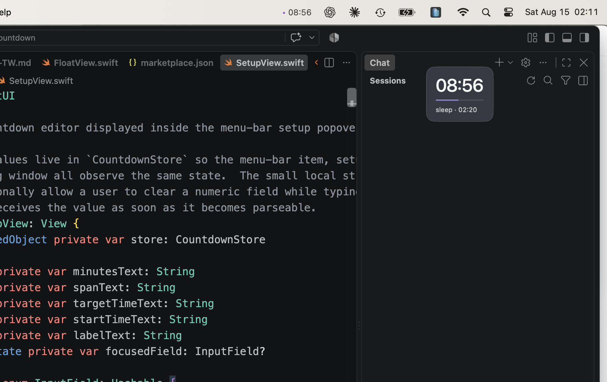

<div align="center">
  <p><a href="README.zh-TW.md">繁體中文版</a></p>
  <h1>Countdown Float</h1>
  <p>Keep multiple countdowns or count-up timers visible on your desktop without switching windows.</p>
  <p>
    <a href="https://github.com/koru1130/FloatingCountdown">
      
    </a>
    <a href="https://www.swift.org/">
      
    </a>
    <a href="https://developer.apple.com/xcode/">
      
    </a>
  </p>
</div>

<p align="center">
  
  
</p>

<p align="center">
  
</p>

<p align="center">
  <sub>Current screenshots: Ring mode, Bar mode, and Countdown Float running alongside Xcode.</sub>
</p>

## Product overview

Countdown Float is a native macOS menu-bar timer utility. It puts lightweight, draggable, always-on-top timer floats on your desktop, so you can keep an eye on your progress while coding, reading, attending a meeting, running a Pomodoro session, or waiting for a specific time.

You can run multiple timers at once. Each timer has its own state, float, editor, and completion flow, while the menu-bar item provides one place to add and manage them. Hiding one float only hides that window—the timer continues to run in the background.

### ADHD and time blindness

For people with ADHD-related time blindness—or anyone who loses track of time while deeply focused—Countdown Float provides persistent, glanceable time cues. Keeping timers visible on the desktop can make elapsed and remaining time easier to notice without repeatedly switching away from the current task. It is a productivity aid, not a medical or diagnostic tool.

> This project is provided as an Xcode-buildable MVP source project. A prebuilt `.app` is also available in the v0.1.0 release.

## Download

[Download Countdown Float v0.1.0](https://github.com/koru1130/FloatingCountdown/releases/download/v0.1.0/CountdownFloat-v0.1.0.app.zip) · [View all releases](https://github.com/koru1130/FloatingCountdown/releases)

## Features

- **Multiple independent timers**: Create any number of timers from the menu bar and control each one separately.
- **Desktop timer floats**: Borderless, translucent, always-on-top, draggable, and available across Spaces.
- **Three timer modes**: Start a Duration countdown, count down to an absolute time, or Count up from `00:00`.
- **Countdown display modes**: Duration and At a time support Bar or Ring; Count up intentionally uses Bar only.
- **Flexible progress span**: Configure a Full span or Start time so the progress bar or ring can represent a larger work session.
- **Labels**: Give each timer a task name, meeting name, or any other custom label, and edit it while the timer is running.
- **Per-timer controls**: Show or hide, edit, Pause, Resume, extend a countdown, reset a Count up timer, or Stop one timer without affecting the others.
- **Compact edit panel**: Opens beside its timer with label, Pause／Resume, per-timer size, and Add 5 min controls—or Reset for Count up; close it with the `×` button or by moving focus elsewhere.
- **Urgent state**: The final five minutes use a highlighted border, glow, and scale treatment.
- **Overtime after countdown completion**: Once a countdown reaches zero, it displays `+mm:ss` so you can see how long it has run past zero.
- **Flexible float size**: Adjust each float's persisted 75%–150% size from its editor or by scrolling while the pointer is over it.
- **System notifications**: Receive a macOS notification when the countdown completes, with direct `Add 5 min` and `End` actions.
- **No third-party dependencies**: Built with SwiftUI, AppKit, Combine, and UserNotifications.

## Screenshots and UI overview

| Surface | Description |
| --- | --- |
| **Float — Bar** | Shows a countdown or count-up time, a horizontal progress bar, and an end time or label. |
| **Float — Ring** | Shows countdown progress as a circular ring in a compact layout; it is not used for Count up. |
| **New timer panel** | Configure Duration, At a time, or Count up, plus the options available for that mode. |
| **Edit panel** | Opens beside one float with a live label field, Pause／Resume, 75%–150% size controls, Add 5 min for countdowns or Reset for Count up, and an upper-right `×`. |
| **Menu-bar extra** | Shows a representative timer and `+N` when more timers are active, or `New` when none are active. |
| **Countdown menu** | Lists all timers and provides New, show／hide, edit, pause／resume, extend, stop, and quit actions. Stopping a timer keeps the menu open. |
| **Completion toast / notification** | Shows the over-time state and provides extend or end actions. |

The Ring and Bar screenshots above show the current float surfaces, and the Xcode screenshot shows the app running alongside its source. The complete UI states reference is available at [`DesignFromClaude/handoff/ui-states.png`](DesignFromClaude/handoff/ui-states.png); it is a design reference rather than a simulated desktop screenshot.

## Requirements

- macOS 13.0 or later
- Xcode 16 or later
- Swift 5 language mode
- No additional packages or third-party dependencies

## Installation and running

### Using Xcode

```sh
git clone https://github.com/koru1130/FloatingCountdown.git
cd FloatingCountdown
open CountdownFloat.xcodeproj
```

In Xcode, select the `CountdownFloat` scheme and press Run. The app is a menu-bar app, so it does not show a regular application icon in the Dock. On launch, the New countdown panel opens near the upper-right of the current screen.

### Building from the command line

```sh
xcodebuild \
  -project CountdownFloat.xcodeproj \
  -scheme CountdownFloat \
  -configuration Debug \
  -destination 'platform=macOS' \
  -derivedDataPath .build/DerivedData \
  build \
  CODE_SIGNING_ALLOWED=NO
```

You can also use the project-local script to build and launch the app:

```sh
./script/build_and_run.sh
```

`script/build_and_run.sh` builds the Debug app and opens it by default. It first terminates any running process with the same name. Use `--verify` to check that the app launches successfully, or `--telemetry` to stream the app's runtime log.

## How to use

1. Click the Countdown Float item in the menu bar to open the timer list, then click `New`. The app also opens a New countdown panel when it launches.
2. Choose a timer mode:
   - **Duration**: Enter 1–600 minutes, or choose the 5, 15, 25, or 60-minute preset.
   - **At a time**: Enter a target time in `HH:mm`; a time that has already passed is treated as tomorrow.
   - **Count up**: Start at `00:00` and continue upward until stopped.
3. Optionally enter a Label. Duration also supports Full span; At a time supports Start time.
4. For a countdown, choose `Bar` or `Ring`. Count up is always Bar. Press `Start`.
5. Repeat `New` to create more independent timers. Drag each float into position, or scroll over it to enlarge or shrink it.
6. Hover over a float to reveal its edit (`…`) and hide (`×`) controls. The compact editor opens beside that float; label changes are applied immediately, and the `−`／`+` controls resize only that float between 75% and 150%. Countdown editors provide Add 5 min, while Count up editors provide Reset to `00:00`. The panel closes via its `×` or when it loses focus.
7. Use each menu row to show／hide, edit, Pause／Resume, Add 5 min for a countdown, or Stop that timer. Stopping one removes its row without closing the menu.
8. When a countdown completes, its float switches to overtime display and its own completion notification appears. If macOS asks for notification permission, allow it to receive system notifications and their quick actions.

### Time and progress rules

- Normal time uses `mm:ss`; durations longer than one hour use `h:mm:ss`.
- After completion, the display uses `+mm:ss` or `+h:mm:ss` to show elapsed overtime.
- Count up starts at `00:00`, has no target or completion notification, uses Bar only, and provides Reset instead of Add 5 min in its editor.
- The default Urgent threshold is five minutes remaining.
- `Add 5 min` adds 300 seconds and extends the total progress span.
- Hiding a float does not pause its timer; the menu-bar item and notifications continue to update.
- Bar mode drains to zero at completion; Ring mode closes into a full circle.

## Interaction states

```text
New ── Start countdown ──▶ Running ◀── Pause / Resume ──▶ Paused
                              │
                              ├── Add 5 min ───────────▶ Running
                              └── Reach zero ──────────▶ Done / overtime

New ── Start Count up ───▶ Running upward ◀── Pause / Resume ──▶ Paused
                                  ▲
                                  └── Reset to 00:00 ──────────┘

Any active timer ── Stop / End ──▶ Removed
```

## Project structure

```text
FloatingCountdown/
├── README.md
├── README.zh-TW.md
├── CountdownFloat.xcodeproj/
├── CountdownFloat/
│   ├── App/              # SwiftUI App and AppKit coordinator
│   ├── Model/            # Timer collection/state, time calculations, geometry, and scale settings
│   ├── Panels/           # Float, editor, and completion NSPanel controllers
│   ├── Services/         # macOS UserNotifications integration
│   ├── Views/            # SwiftUI float, setup panel, menu, and notification UI
│   └── Info.plist
├── CountdownFloatTests/  # Store, collection, geometry, and scale-setting tests
├── DesignFromClaude/     # UI states and design handoff documents
└── script/               # Local build and launch scripts
```

### Core components

| Component | Responsibility |
| --- | --- |
| `CountdownCollection` | Publishes the active timer stores shown by the menu-bar list. |
| `CountdownStore` | Uses `@MainActor` to manage one countdown or count-up timer, including lifecycle, formatting, progress, Urgent state, and completion events. |
| `AppDelegate` | Owns the per-timer sessions and coordinates the menu-bar item, timer list, panels, and notification callbacks. |
| `SetupPanelController` | Presents the New timer panel or the compact editor beside the selected timer, with focus-loss dismissal for editing. |
| `FloatPanelController` | Manages the borderless always-on-top float, drag position, screen clamping, and size scaling. |
| `FloatView` | Renders Bar／Ring modes, state styling, hover controls, and the completion pulse effect. |
| `CompletionPanelController` | Presents the completion toast for the timer that reached zero. |
| `NotificationManager` | Requests notification permission, posts completion notifications, and handles `Add 5 min`／`End` actions. |
| `FloatGeometry` / `FloatScaleSettings` | Provides testable window geometry calculations and a persisted 75%–150% display scale. |

Each active timer owns an independent `CountdownStore`, float panel, editor panel, and completion panel. Actions use the store's UUID so menu and notification operations update the intended timer without affecting the others.

## Building and testing

Run the complete unit-test suite:

```sh
xcodebuild \
  -project CountdownFloat.xcodeproj \
  -scheme CountdownFloat \
  -destination 'platform=macOS' \
  -derivedDataPath .build/DerivedData \
  test \
  CODE_SIGNING_ALLOWED=NO
```

The tests cover:

- `CountdownStore` behavior for starting countdowns and Count up timers, Pause, Resume, completion, overtime, Add 5 min, Stop, and Reset.
- `CountdownCollection` behavior for multiple independent timer stores.
- Duration and At a time parsing, including the “past target means tomorrow” rule.
- `mm:ss`, `h:mm:ss`, and `+mm:ss` formatting.
- Initial float placement, screen-boundary clamping, resize anchors, persisted scale settings, and scroll-to-zoom step handling.

`CountdownStore` accepts an injected `DateProvider`, so time-based tests do not need to wait for a real countdown to finish.

## Data, permissions, and privacy

- No account is required, and the app makes no network requests or calls to a remote service.
- Timer state lives only in the current app process; active timers are not restored after relaunch.
- Float positions and display scales are stored locally in `UserDefaults` so they can be restored on the next launch.
- System notifications are used only when a countdown completes. macOS owns the notification permission, and you can disable it at any time in System Settings.

## Design documents

Design and implementation reference material is available in `DesignFromClaude/`:

- [UI states overview](DesignFromClaude/handoff/ui-states.png)
- [Design handoff notes](DesignFromClaude/handoff/README.md)
- [Complete design spec](DesignFromClaude/handoff/design-spec.md)
- [Interactive reference](DesignFromClaude/Countdown%20Float%20Reference.dc.html)

## Known limitations

- There is currently no signing, packaging, or automatic update workflow.
- Active timers are not persisted; new timers must be configured after quitting the app.
- Notification behavior depends on macOS notification permissions and system settings.

## Contributing

Issues and pull requests are welcome. Before submitting a change:

1. Describe the problem or user scenario you are addressing.
2. Add or update unit tests for behavioral changes.
3. Confirm that `xcodebuild ... test CODE_SIGNING_ALLOWED=NO` passes.
4. If you change the UI, update the relevant documentation or preview material in `DesignFromClaude/`.

## License

This repository does not currently include a `LICENSE` file. Please contact the author before redistributing, using it commercially, or integrating it into another project.
